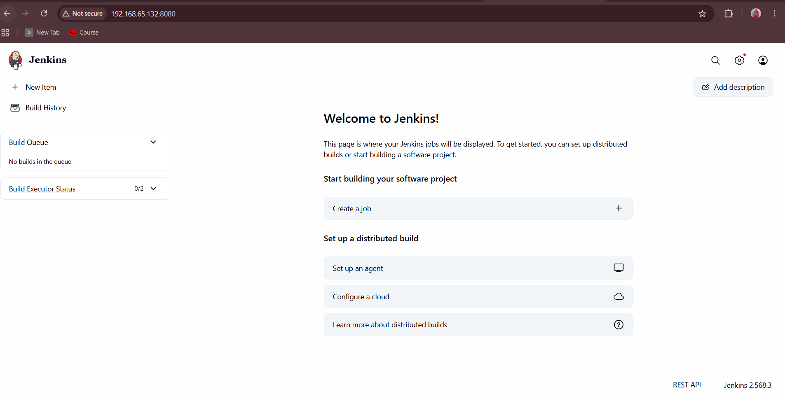
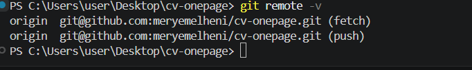

# Activité de démarrage : Ubuntu Server, SSH, Docker, Jenkins et Git

Ce dépôt contient un CV One Page (HTML5, CSS3, JavaScript) et le compte rendu du TP.
Chaque étape liste les commandes exécutées et renvoie vers une capture d'écran du dossier `screenshots/`.

Dépôt : https://github.com/meryemelheni/cv-onepage

## Environnement

| Élément | Valeur |
|---|---|
| Hyperviseur | VMware Workstation Pro |
| Système invité | Ubuntu Server 26.04 LTS |
| Réseau de la VM | NAT, adresse `192.168.65.132` |
| Utilisateur de la VM | `meryem` |
| Machine physique | Windows, PowerShell |

## 1. Ubuntu Server 26.04 et accès SSH sécurisé

Machine virtuelle créée avec 2 cœurs, 6 Go de RAM et 25 Go de disque. Le paquet OpenSSH server est coché pendant l'installation.

Vérification du service dans la VM :

#bash
ip a
sudo systemctl status ssh

Sécurisation : connexion par clé uniquement, mot de passe et accès root désactivés.

sudo nano /etc/ssh/sshd_config.d/01-hardening.conf

Contenu du fichier :

PermitRootLogin no
PasswordAuthentication no
PubkeyAuthentication yes

sudo systemctl restart ssh
sudo sshd -T | grep -i passwordauthentication

Résultat attendu : `passwordauthentication no`.

## 2. Test de l'accès SSH depuis la machine physique

Création de la clé (sur Windows) et copie de la clé publique vers la VM :

#powershell
ssh-keygen -t ed25519 -f $env:USERPROFILE\.ssh\id_tp_docker
type $env:USERPROFILE\.ssh\id_tp_docker.pub | ssh -o PubkeyAuthentication=no meryem@192.168.65.132 "mkdir -p ~/.ssh && chmod 700 ~/.ssh && tr -d '\r' >> ~/.ssh/authorized_keys && chmod 600 ~/.ssh/authorized_keys"

Fichier `~/.ssh/config` sur Windows :

Host 192.168.65.132
    IdentityFile ~/.ssh/id_tp_docker
    IdentitiesOnly yes

Connexion par clé :

#powershell
ssh meryem@192.168.65.132

Test du refus du mot de passe :

#powershell
ssh -o PubkeyAuthentication=no meryem@192.168.65.132

Résultat : `Permission denied (publickey)`.

## 3. Installation de Docker sur la VM

Installation depuis le dépôt officiel de Docker :

#bash
sudo apt update
sudo apt install -y ca-certificates curl
sudo install -m 0755 -d /etc/apt/keyrings
sudo curl -fsSL https://download.docker.com/linux/ubuntu/gpg -o /etc/apt/keyrings/docker.asc
sudo chmod a+r /etc/apt/keyrings/docker.asc
echo "deb [arch=$(dpkg --print-architecture) signed-by=/etc/apt/keyrings/docker.asc] https://download.docker.com/linux/ubuntu $(. /etc/os-release && echo "${UBUNTU_CODENAME:-$VERSION_CODENAME}") stable" | sudo tee /etc/apt/sources.list.d/docker.list > /dev/null
sudo apt update
sudo apt install -y docker-ce docker-ce-cli containerd.io docker-buildx-plugin docker-compose-plugin

Vérification :

#bash
sudo systemctl status docker
sudo docker run hello-world

Utilisation de Docker sans `sudo`, puis test avec nginx :

#bash
sudo usermod -aG docker $USER
docker --version
docker run -d -p 80:80 --name web nginx
docker ps

Page de nginx ouverte depuis Windows sur `http://192.168.65.132` :

#bash
docker stop web && docker rm web

## 4. Installation de Jenkins comme service

#bash
sudo apt install -y fontconfig openjdk-21-jre-headless
sudo wget -O /etc/apt/keyrings/jenkins-keyring.asc https://pkg.jenkins.io/debian-stable/jenkins.io-2026.key
echo "deb [signed-by=/etc/apt/keyrings/jenkins-keyring.asc] https://pkg.jenkins.io/debian-stable binary/" | sudo tee /etc/apt/sources.list.d/jenkins.list > /dev/null
sudo apt update
sudo apt install -y jenkins
sudo systemctl enable --now jenkins
sudo systemctl status jenkins

Le service est `active (running)` et `enabled`.

Tableau de bord ouvert depuis Windows sur `http://192.168.65.132:8080` :

## 5. CV One Page avec Git

Le CV est composé de `index.html`, `style.css` et `script.js`. Le dossier est géré avec Git :

#powershell
git init
git add .
git commit -m "Premier commit : CV one page"
git branch -M main

## 6. Push GitHub via SSH

Création d'une clé dédiée à GitHub :

#powershell
ssh-keygen -t ed25519 -C "elhenimeryem12@gmail.com" -f $env:USERPROFILE\.ssh\id_github
Get-Content $env:USERPROFILE\.ssh\id_github.pub | Set-Clipboard

Ajout de la clé publique dans GitHub, **Settings > SSH and GPG keys > New SSH key**.

Bloc ajouté au fichier `~/.ssh/config` :

Host github.com
    HostName github.com
    User git
    IdentityFile ~/.ssh/id_github
    IdentitiesOnly yes

Test de l'authentification :

#powershell
ssh -T git@github.com

Configuration du dépôt local pour utiliser SSH, puis envoi du code :

#powershell
git remote add origin git@github.com:meryemelheni/cv-onepage.git
git remote -v
git push -u origin main

Vérification que le dépôt local utilise SSH :

Dépôt en ligne sur GitHub :

