# Activité de démarrage : Ubuntu Server, SSH, Docker, Jenkins et Git

Ce dépôt contient un CV One Page (HTML5, CSS3, JavaScript) et le compte rendu du TP.
Chaque étape liste les commandes exécutées et renvoie vers une capture d'écran du dossier `screenshots/`.

Dépôt : https://github.com/meryemelheni/cv-onepage

## Environnement

| Élément | Valeur |
|---|---|
| Hyperviseur | VMware Workstation Pro |
| Système invité | Ubuntu Server 26.04 LTS |
| Réseau de la VM | NAT, adresse `192.168.65.132` |
| Utilisateur de la VM | `meryem` |
| Machine physique | Windows, PowerShell |

## 1. Ubuntu Server 26.04 et accès SSH sécurisé

Machine virtuelle créée avec 2 cœurs, 6 Go de RAM et 25 Go de disque. Le paquet OpenSSH server est coché pendant l'installation.

Vérification du service dans la VM :

```bash
ip a
sudo systemctl status ssh
```

Sécurisation : connexion par clé uniquement, mot de passe et accès root désactivés.

```bash
sudo nano /etc/ssh/sshd_config.d/01-hardening.conf
```

Contenu du fichier :

```
PermitRootLogin no
PasswordAuthentication no
PubkeyAuthentication yes
```

```bash
sudo systemctl restart ssh
sudo sshd -T | grep -i passwordauthentication
```

Résultat attendu : `passwordauthentication no`.

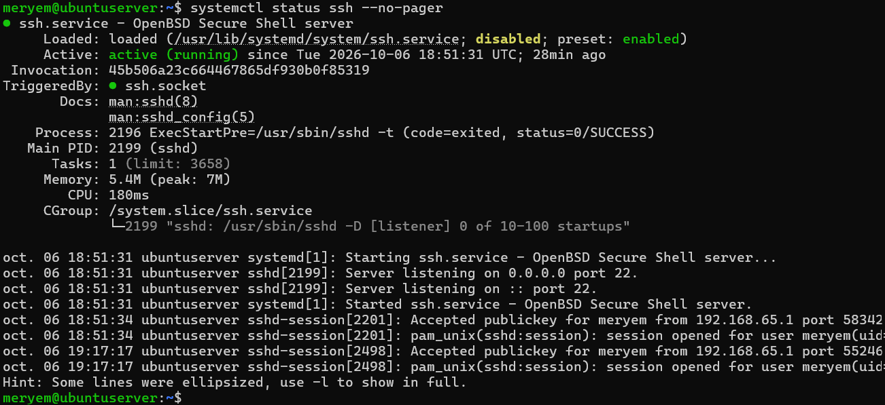

## 2. Test de l'accès SSH depuis la machine physique

Création de la clé (sur Windows) et copie de la clé publique vers la VM :

```powershell
ssh-keygen -t ed25519 -f $env:USERPROFILE\.ssh\id_tp_docker
type $env:USERPROFILE\.ssh\id_tp_docker.pub | ssh -o PubkeyAuthentication=no meryem@192.168.65.132 "mkdir -p ~/.ssh && chmod 700 ~/.ssh && tr -d '\r' >> ~/.ssh/authorized_keys && chmod 600 ~/.ssh/authorized_keys"
```

Fichier `~/.ssh/config` sur Windows :

```
Host 192.168.65.132
    IdentityFile ~/.ssh/id_tp_docker
    IdentitiesOnly yes
```

Connexion par clé :

```powershell
ssh meryem@192.168.65.132
```

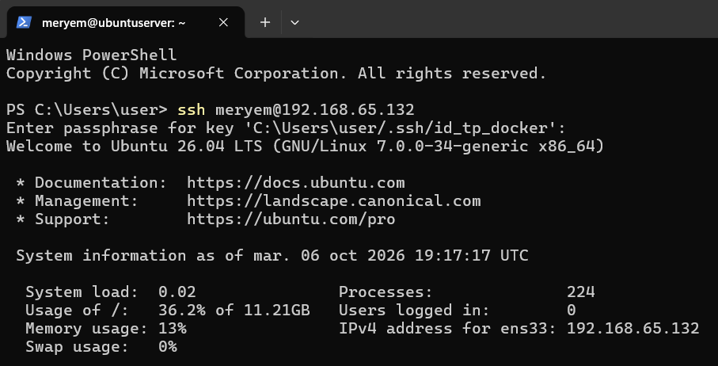

Test du refus du mot de passe :

```powershell
ssh -o PubkeyAuthentication=no meryem@192.168.65.132
```

Résultat : `Permission denied (publickey)`.

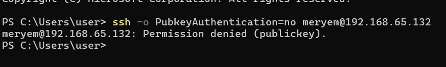

## 3. Installation de Docker sur la VM

Installation depuis le dépôt officiel de Docker :

```bash
sudo apt update
sudo apt install -y ca-certificates curl
sudo install -m 0755 -d /etc/apt/keyrings
sudo curl -fsSL https://download.docker.com/linux/ubuntu/gpg -o /etc/apt/keyrings/docker.asc
sudo chmod a+r /etc/apt/keyrings/docker.asc
echo "deb [arch=$(dpkg --print-architecture) signed-by=/etc/apt/keyrings/docker.asc] https://download.docker.com/linux/ubuntu $(. /etc/os-release && echo "${UBUNTU_CODENAME:-$VERSION_CODENAME}") stable" | sudo tee /etc/apt/sources.list.d/docker.list > /dev/null
sudo apt update
sudo apt install -y docker-ce docker-ce-cli containerd.io docker-buildx-plugin docker-compose-plugin
```

Vérification :

```bash
sudo systemctl status docker
sudo docker run hello-world
```

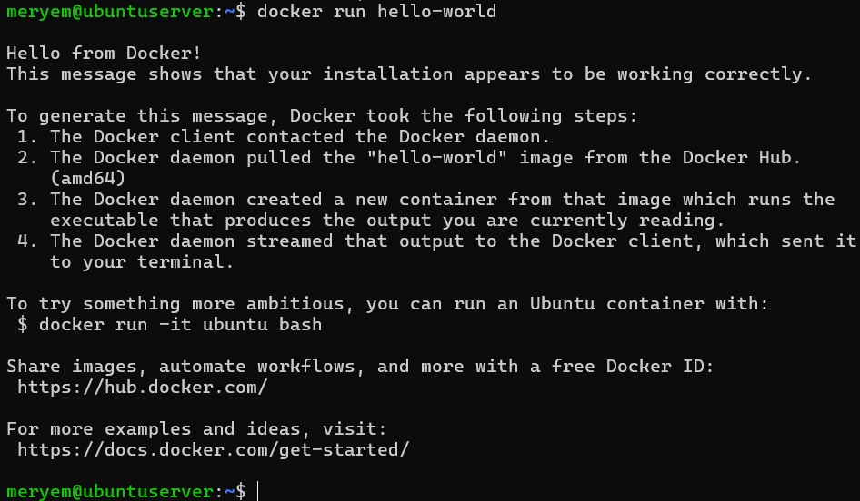

Utilisation de Docker sans `sudo`, puis test avec nginx :

```bash
sudo usermod -aG docker $USER
docker --version
docker run -d -p 80:80 --name web nginx
docker ps
```

Page de nginx ouverte depuis Windows sur `http://192.168.65.132` :

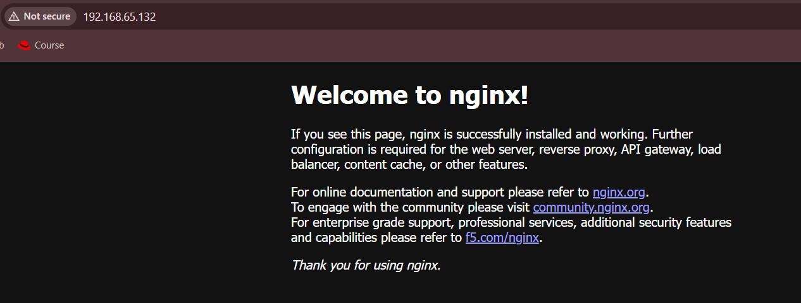

```bash
docker stop web && docker rm web
```

## 4. Installation de Jenkins comme service

```bash
sudo apt install -y fontconfig openjdk-21-jre-headless
sudo wget -O /etc/apt/keyrings/jenkins-keyring.asc https://pkg.jenkins.io/debian-stable/jenkins.io-2026.key
echo "deb [signed-by=/etc/apt/keyrings/jenkins-keyring.asc] https://pkg.jenkins.io/debian-stable binary/" | sudo tee /etc/apt/sources.list.d/jenkins.list > /dev/null
sudo apt update
sudo apt install -y jenkins
sudo systemctl enable --now jenkins
sudo systemctl status jenkins
```

Le service est `active (running)` et `enabled`.

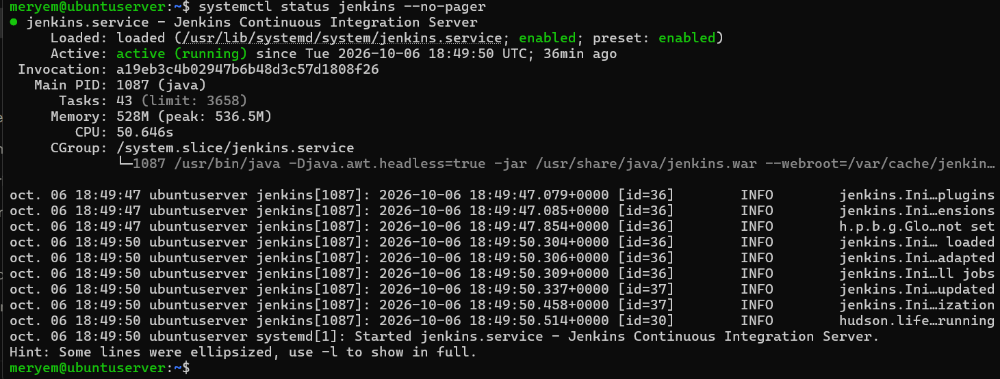

Tableau de bord ouvert depuis Windows sur `http://192.168.65.132:8080` :


## 5. CV One Page avec Git

Le CV est composé de `index.html`, `style.css` et `script.js`. Le dossier est géré avec Git :

```powershell
git init
git add .
git commit -m "Premier commit : CV one page"
git branch -M main
```

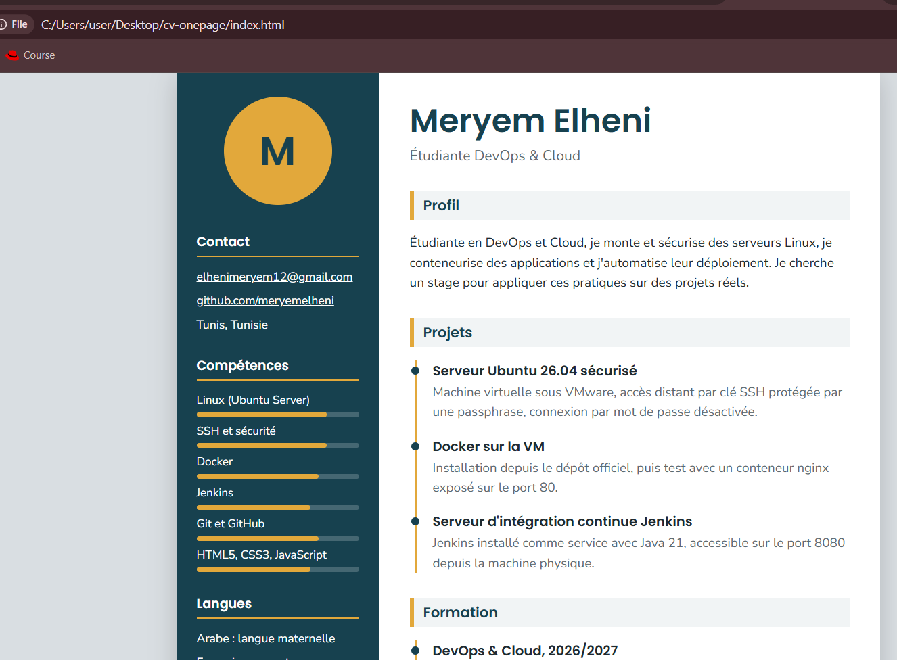

## 6. Push GitHub via SSH

Création d'une clé dédiée à GitHub :

```powershell
ssh-keygen -t ed25519 -C "elhenimeryem12@gmail.com" -f $env:USERPROFILE\.ssh\id_github
Get-Content $env:USERPROFILE\.ssh\id_github.pub | Set-Clipboard
```

Ajout de la clé publique dans GitHub, **Settings > SSH and GPG keys > New SSH key**.

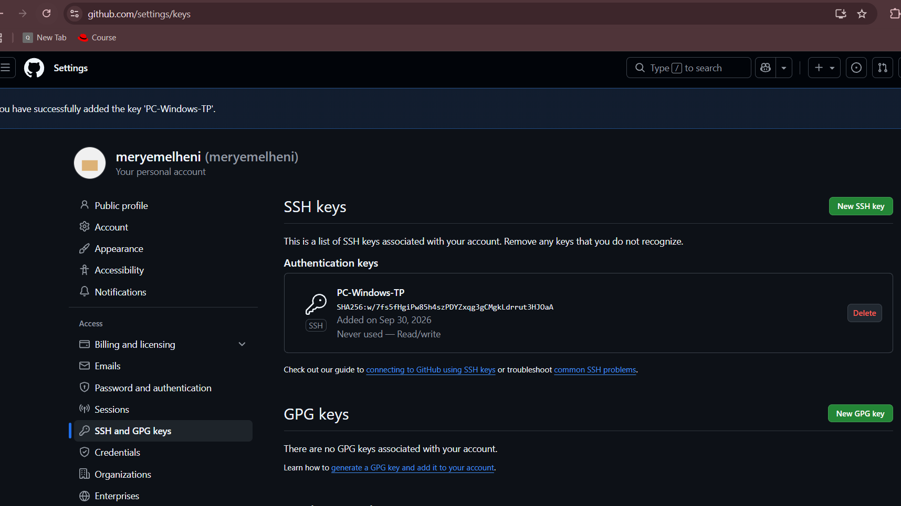

Bloc ajouté au fichier `~/.ssh/config` :

```
Host github.com
    HostName github.com
    User git
    IdentityFile ~/.ssh/id_github
    IdentitiesOnly yes
```

Test de l'authentification :

```powershell
ssh -T git@github.com
```

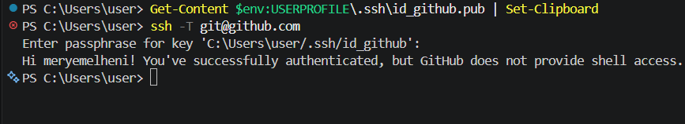

Configuration du dépôt local pour utiliser SSH, puis envoi du code :

```powershell
git remote add origin git@github.com:meryemelheni/cv-onepage.git
git remote -v
git push -u origin main
```

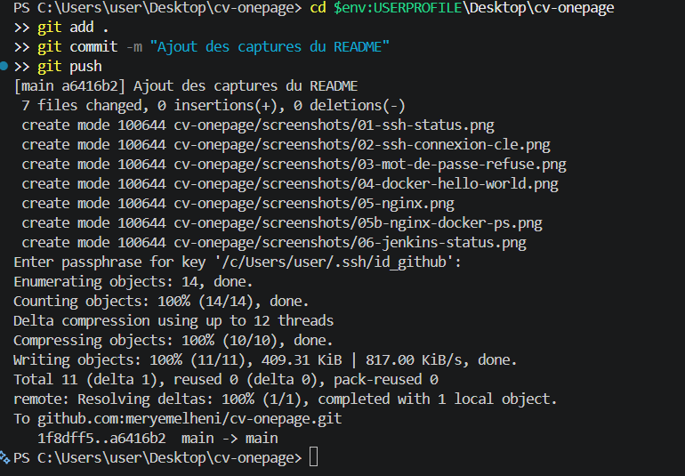

## 7. Évolution du CV vers un DevSecOps Portfolio

Le mini CV est devenu une petite application web d'une seule page, avec les sections **About, Skills, DevSecOps Skills, Projects, Experience et Contact**.

Principales améliorations par rapport au CV :

- une barre de navigation fixe en haut, avec un lien vers chaque section ;
- six sections au lieu d'une page de présentation unique ;
- des cartes (grille responsive) pour les outils et les projets ;
- une frise chronologique pour l'expérience ;
- les données des outils et des projets séparées de la mise en page, dans des tableaux JavaScript ;
- un projet prêt à être conteneurisé (Dockerfile et `docker-compose.yml`).

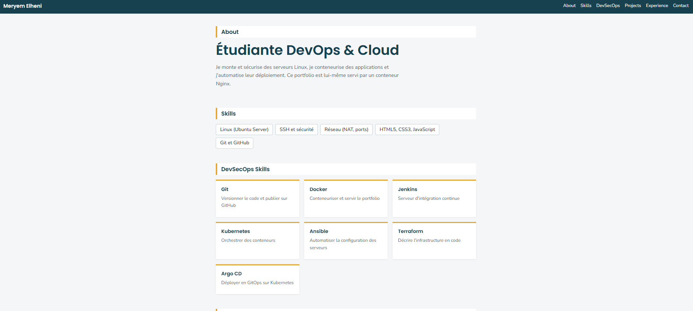

## 8. Section DevSecOps Skills

Cette section affiche les technologies du projet : Git, Docker, Jenkins, Kubernetes, Ansible, Terraform et Argo CD. Chaque carte indique le rôle de l'outil. La section est visible au milieu de la capture ci-dessous, sous la section Skills.


## 9. Section Projects générée en JavaScript

Les projets sont décrits dans un tableau d'objets (`projects`). Le script parcourt ce tableau et crée une carte pour chaque objet. Ajouter un projet revient à ajouter un objet au tableau, sans toucher au HTML.

Extrait de `script.js` :

```javascript
var projects = [
  { title: 'Serveur Ubuntu 26.04 sécurisé', description: 'VM VMware, accès SSH par clé avec passphrase, mot de passe désactivé.', tech: ['Ubuntu', 'SSH'], link: 'https://github.com/meryemelheni/cv-onepage' },
  { title: 'Nginx dans Docker', description: 'Conteneur nginx exposé sur un port et testé depuis la machine physique.', tech: ['Docker', 'Nginx'], link: 'https://github.com/meryemelheni/cv-onepage' },
  { title: 'Serveur Jenkins', description: 'Jenkins installé comme service systemd avec Java 21.', tech: ['Jenkins', 'Java'], link: 'https://github.com/meryemelheni/cv-onepage' },
  { title: 'DevSecOps Portfolio', description: 'Ce site, dockérisé avec Nginx et déployé avec Docker Compose.', tech: ['Docker Compose', 'JavaScript'], link: 'https://github.com/meryemelheni/cv-onepage' }
];

var projectBox = document.getElementById('project-list');
projects.forEach(function (p) {
  var foot = document.createElement('div');
  var tech = document.createElement('small');
  tech.textContent = p.tech.join(', ');
  var a = document.createElement('a');
  a.href = p.link;
  a.textContent = 'Voir le dépôt';
  foot.appendChild(tech);
  foot.appendChild(a);
  projectBox.appendChild(card(p.title, p.description, foot));
});
```

Résultat dans le navigateur :

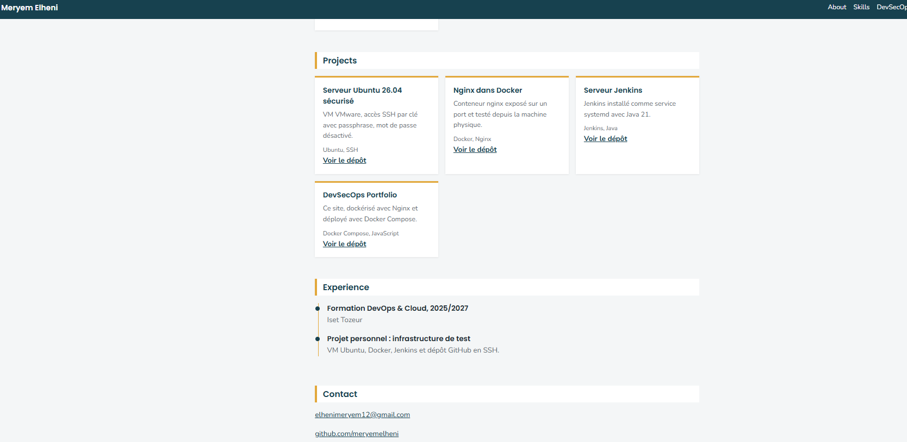

## 10. Dockerfile

Contenu du fichier `Dockerfile` :

```dockerfile
FROM nginx:alpine
COPY index.html style.css script.js /usr/share/nginx/html/
EXPOSE 80
```

Explication :

- `FROM nginx:alpine` : l'image de départ est Nginx sur Alpine Linux, une base légère.
- `COPY ... /usr/share/nginx/html/` : les trois fichiers du portfolio sont copiés dans le dossier que Nginx sert par défaut.
- `EXPOSE 80` : l'image indique que Nginx écoute sur le port 80. La publication du port vers la VM se fait avec `-p` ou avec Docker Compose.

Aucune commande de démarrage n'est nécessaire : l'image `nginx` lance déjà Nginx au démarrage du conteneur.

## 11. Construction de l'image Docker `cv-docker`

Commande utilisée, depuis le dossier du projet cloné dans la VM :

```bash
docker build -t cv-docker .
docker images cv-docker
```

Le build s'est terminé sans erreur, et l'image `cv-docker:latest` est créée.

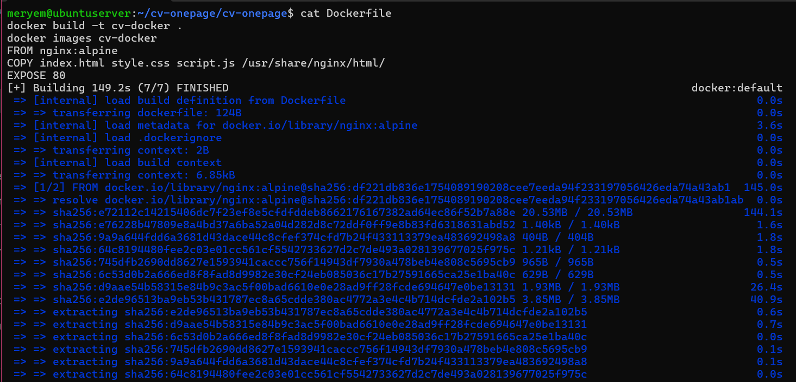

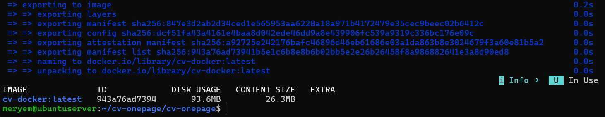

## 12. Exécution d'un conteneur

Commande utilisée :

```bash
docker run -d --name cv-docker -p 8081:80 cv-docker
docker ps
```

Le port 80 du conteneur est publié sur le port 8081 de la VM. Résultat de `docker ps` :

```
CONTAINER ID   IMAGE       COMMAND                  CREATED                  STATUS                  PORTS                                     NAMES
d7180b4acf85   cv-docker   "/docker-entrypoint.…"   Less than a second ago   Up Less than a second   0.0.0.0:8081->80/tcp, [::]:8081->80/tcp   cv-docker
```

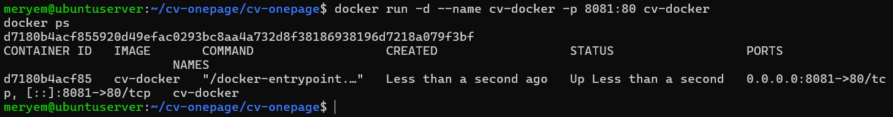

Accès depuis la machine physique sur `http://192.168.65.132:8081` :

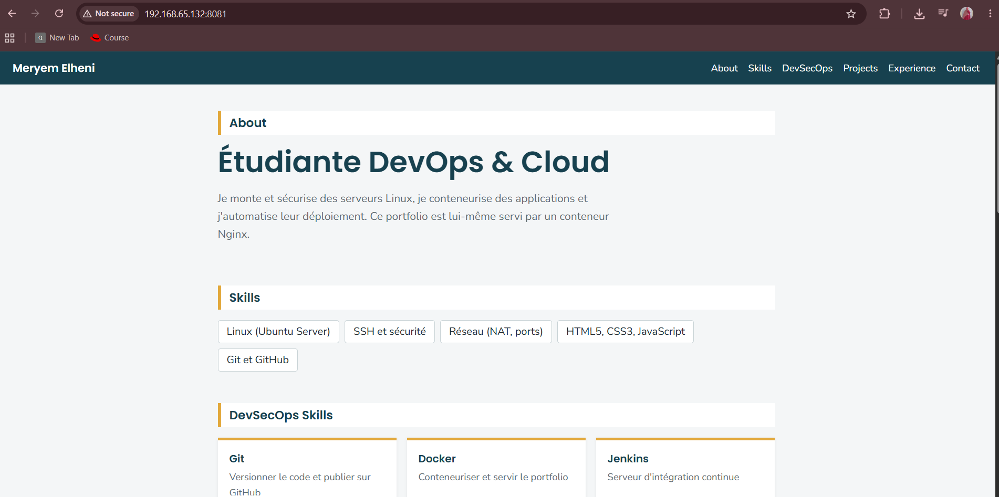

## 13. Déploiement avec Docker Compose

Contenu de `docker-compose.yml` :

```yaml
services:
  portfolio:
    build: .
    image: cv-docker
    container_name: portfolio
    ports:
      - "8082:80"
    restart: unless-stopped
```

Le conteneur précédent est supprimé avant (`docker stop cv-docker && docker rm cv-docker`). Commandes utilisées :

```bash
docker compose up -d
docker compose ps
```

Résultat de `docker compose ps` :

```
NAME        IMAGE       COMMAND                  SERVICE     CREATED         STATUS                  PORTS
portfolio   cv-docker   "/docker-entrypoint.…"   portfolio   1 second ago    Up Less than a second   0.0.0.0:8082->80/tcp, [::]:8082->80/tcp
```

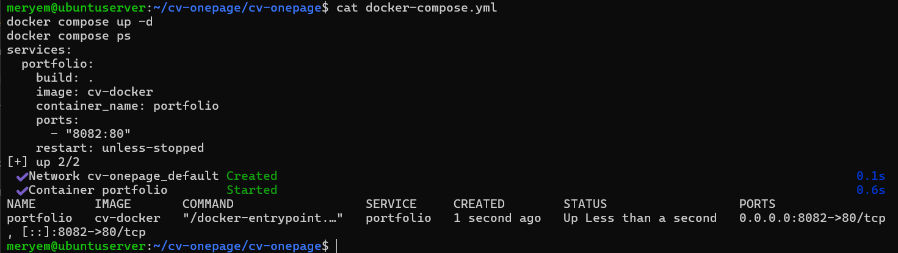

Accès depuis la machine physique sur `http://192.168.65.132:8082` :

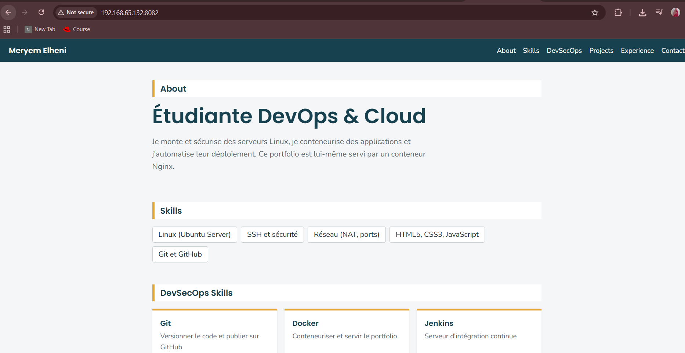

## 14. Publication sur GitHub via SSH

Commandes Git utilisées, depuis Windows, avec la clé SSH `id_github` :

```powershell
git add .
git commit -m "Portfolio DevSecOps, Dockerfile et docker-compose"
git push
git remote -v
```

`git remote -v` confirme que le dépôt utilise SSH (`git@github.com:meryemelheni/cv-onepage.git`). Tous les fichiers du projet se trouvent dans le dossier `cv-onepage` du dépôt.

Lien du dépôt GitHub mis à jour : https://github.com/meryemelheni/cv-onepage
