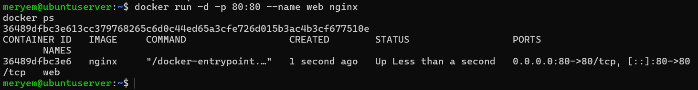
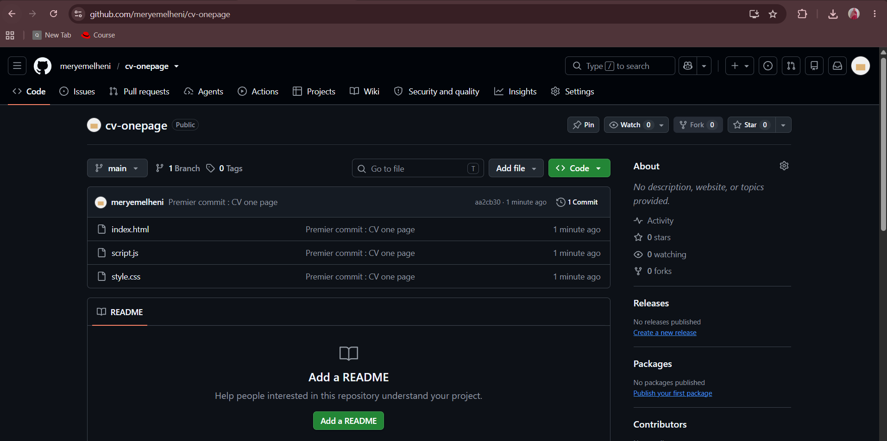
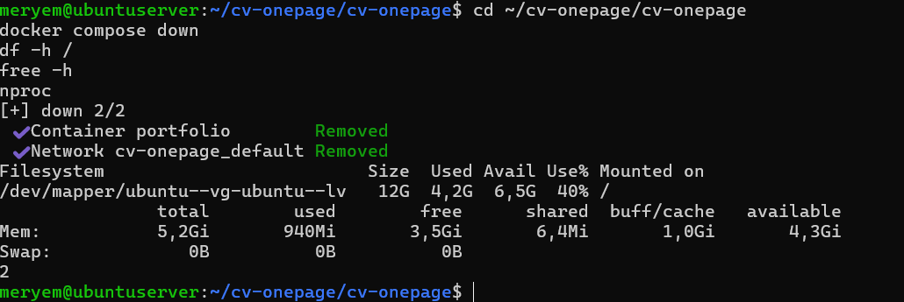
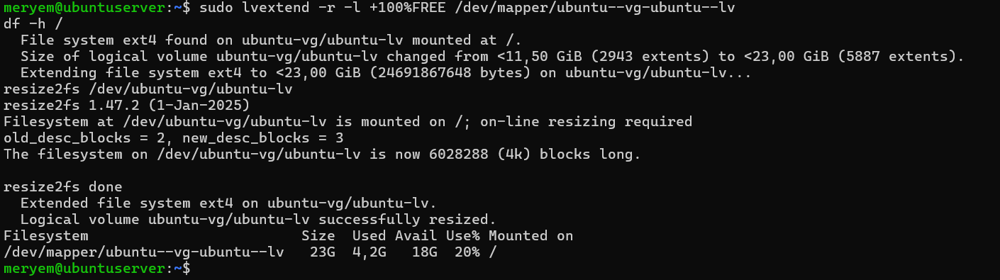
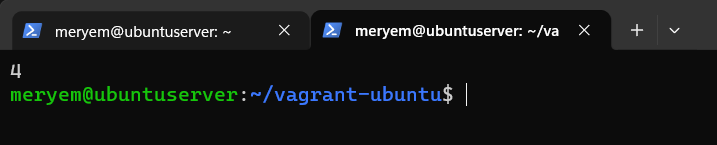
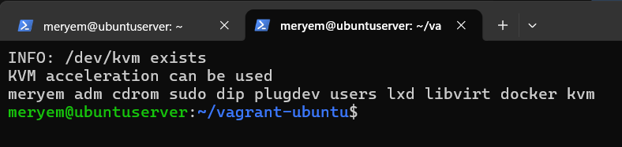
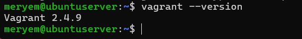
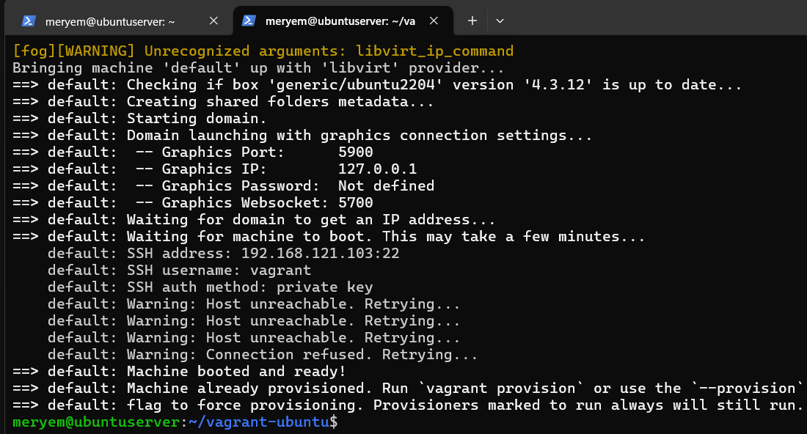
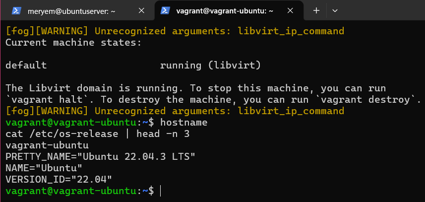

# Activité de démarrage : Ubuntu Server, SSH, Docker, Jenkins, Git et Vagrant

Ce dépôt contient le DevSecOps Portfolio (HTML5, CSS3, JavaScript) et le compte rendu du TP.
Pour chaque point : les commandes exécutées, des explications et les captures d'écran du dossier `screenshots/`.

Dépôt GitHub : https://github.com/meryemelheni/cv-onepage

## Environnement

| Élément | Valeur |
|---|---|
| Machine physique | Windows, PowerShell, VS Code, Chrome |
| Hyperviseur | VMware Workstation Pro |
| Système invité | Ubuntu Server 26.04 LTS |
| Ressources de la VM | 2 CPU, 6 Go de RAM, disque de 25 Go |
| Réseau de la VM | NAT, adresse `192.168.65.132` |
| Utilisateur de la VM | `meryem` |

## 1. Ubuntu Server 26.04 et accès SSH sécurisé

La VM est créée avec l'ISO `ubuntu-26.04-live-server-amd64.iso`. L'option « Install OpenSSH server » est cochée pendant l'installation.

Vérification du service dans la VM :

```bash
ip a
systemctl status ssh --no-pager
```


Sécurisation : la connexion se fait par clé uniquement. Le mot de passe et la connexion en root sont désactivés.

```bash
sudo nano /etc/ssh/sshd_config.d/01-hardening.conf
```

```
PermitRootLogin no
PasswordAuthentication no
PubkeyAuthentication yes
```

```bash
sudo systemctl restart ssh
sudo sshd -T | grep -i passwordauthentication
```

Résultat : `passwordauthentication no`. Le fichier porte le préfixe `01-` pour être lu avant les autres fichiers de configuration.

## 2. Test de l'accès SSH depuis la machine physique

Création d'une clé dédiée, protégée par une passphrase, et copie de la clé publique dans la VM :

```powershell
ssh-keygen -t ed25519 -f $env:USERPROFILE\.ssh\id_tp_docker
type $env:USERPROFILE\.ssh\id_tp_docker.pub | ssh -o PubkeyAuthentication=no meryem@192.168.65.132 "mkdir -p ~/.ssh && chmod 700 ~/.ssh && tr -d '\r' >> ~/.ssh/authorized_keys && chmod 600 ~/.ssh/authorized_keys"
```

Fichier `~/.ssh/config` sur Windows, pour utiliser cette clé avec la VM :

```
Host 192.168.65.132
    IdentityFile ~/.ssh/id_tp_docker
    IdentitiesOnly yes
    ServerAliveInterval 30
```

Connexion par clé :

```powershell
ssh meryem@192.168.65.132
```


Test du refus du mot de passe :

```powershell
ssh -o PubkeyAuthentication=no meryem@192.168.65.132
```

Résultat : `Permission denied (publickey)`.


## 3. Installation de Docker sur la VM

Installation depuis le dépôt officiel de Docker :

```bash
sudo apt update
sudo apt install -y ca-certificates curl
sudo install -m 0755 -d /etc/apt/keyrings
sudo curl -fsSL https://download.docker.com/linux/ubuntu/gpg -o /etc/apt/keyrings/docker.asc
sudo chmod a+r /etc/apt/keyrings/docker.asc
echo "deb [arch=$(dpkg --print-architecture) signed-by=/etc/apt/keyrings/docker.asc] https://download.docker.com/linux/ubuntu $(. /etc/os-release && echo "${UBUNTU_CODENAME:-$VERSION_CODENAME}") stable" | sudo tee /etc/apt/sources.list.d/docker.list > /dev/null
sudo apt update
sudo apt install -y docker-ce docker-ce-cli containerd.io docker-buildx-plugin docker-compose-plugin
```

Vérification et utilisation sans `sudo` :

```bash
sudo systemctl status docker
sudo usermod -aG docker $USER
docker --version
docker run hello-world
```


Test avec un serveur web nginx, ouvert depuis Windows sur `http://192.168.65.132` :

```bash
docker run -d -p 80:80 --name web nginx
docker ps
docker stop web && docker rm web
```




## 4. Installation de Jenkins comme service

```bash
sudo apt install -y fontconfig openjdk-21-jre-headless
sudo wget -O /etc/apt/keyrings/jenkins-keyring.asc https://pkg.jenkins.io/debian-stable/jenkins.io-2026.key
echo "deb [signed-by=/etc/apt/keyrings/jenkins-keyring.asc] https://pkg.jenkins.io/debian-stable binary/" | sudo tee /etc/apt/sources.list.d/jenkins.list > /dev/null
sudo apt update
sudo apt install -y jenkins
sudo systemctl enable --now jenkins
systemctl status jenkins --no-pager
```

Le service est `active (running)` et `enabled`, donc il démarre avec la VM.


Tableau de bord ouvert depuis la machine physique sur `http://192.168.65.132:8080` :


## 5. CV One Page avec Git

Le CV (`index.html`, `style.css`, `script.js`) est géré avec Git :

```powershell
git init
git add .
git commit -m "Premier commit : CV one page"
git branch -M main
```


## 6. Push GitHub via SSH

Création d'une clé dédiée à GitHub et copie de la clé publique :

```powershell
ssh-keygen -t ed25519 -C "elhenimeryem12@gmail.com" -f $env:USERPROFILE\.ssh\id_github
Get-Content $env:USERPROFILE\.ssh\id_github.pub | Set-Clipboard
```

Ajout de la clé publique dans GitHub : **Settings > SSH and GPG keys > New SSH key**.


Bloc ajouté au fichier `~/.ssh/config` :

```
Host github.com
    HostName github.com
    User git
    IdentityFile ~/.ssh/id_github
    IdentitiesOnly yes
```

Test de l'authentification :

```powershell
ssh -T git@github.com
```


Configuration du dépôt local pour utiliser SSH, puis envoi du code :

```powershell
git remote add origin git@github.com:meryemelheni/cv-onepage.git
git remote -v
git push -u origin main
```




## 7. Évolution vers un DevSecOps Portfolio

Le CV est devenu une petite application web d'une page, avec les sections **About, Skills, DevSecOps Skills, Projects, Experience et Contact**.

Principales améliorations :

- une barre de navigation fixe, avec un lien vers chaque section ;
- six sections au lieu d'une page de présentation unique ;
- des cartes (grille responsive) pour les outils et les projets ;
- une frise chronologique pour l'expérience ;
- les données des outils et des projets séparées de la mise en page, dans des tableaux JavaScript ;
- un projet prêt à être conteneurisé (`Dockerfile` et `docker-compose.yml`).


## 8. Section DevSecOps Skills

La section affiche les technologies du projet : Git, Docker, Jenkins, Kubernetes, Ansible, Terraform et Argo CD. Chaque carte indique le rôle de l'outil. Elle se trouve au milieu de la capture ci-dessous, sous la section Skills.


## 9. Section Projects générée en JavaScript

Les projets sont décrits dans un tableau d'objets. Le script parcourt ce tableau et crée une carte par objet. Ajouter un projet revient à ajouter un objet au tableau, sans toucher au HTML.

Extrait de `script.js` :

```javascript
var projects = [
  { title: 'Serveur Ubuntu 26.04 sécurisé', description: 'VM VMware, accès SSH par clé avec passphrase, mot de passe désactivé.', tech: ['Ubuntu', 'SSH'], link: 'https://github.com/meryemelheni/cv-onepage' },
  { title: 'Nginx dans Docker', description: 'Conteneur nginx exposé sur un port et testé depuis la machine physique.', tech: ['Docker', 'Nginx'], link: 'https://github.com/meryemelheni/cv-onepage' },
  { title: 'Serveur Jenkins', description: 'Jenkins installé comme service systemd avec Java 21.', tech: ['Jenkins', 'Java'], link: 'https://github.com/meryemelheni/cv-onepage' },
  { title: 'DevSecOps Portfolio', description: 'Ce site, dockérisé avec Nginx et déployé avec Docker Compose.', tech: ['Docker Compose', 'JavaScript'], link: 'https://github.com/meryemelheni/cv-onepage' }
];

var projectBox = document.getElementById('project-list');
projects.forEach(function (p) {
  var foot = document.createElement('div');
  var tech = document.createElement('small');
  tech.textContent = p.tech.join(', ');
  var a = document.createElement('a');
  a.href = p.link;
  a.textContent = 'Voir le dépôt';
  foot.appendChild(tech);
  foot.appendChild(a);
  projectBox.appendChild(card(p.title, p.description, foot));
});
```

Résultat dans le navigateur :


## 10. Dockerfile

```dockerfile
FROM nginx:alpine
COPY index.html style.css script.js /usr/share/nginx/html/
EXPOSE 80
```

- `FROM nginx:alpine` : image de départ légère, Nginx sur Alpine Linux.
- `COPY` : copie des trois fichiers du portfolio dans le dossier servi par Nginx.
- `EXPOSE 80` : indique le port d'écoute. La publication vers la VM se fait avec `-p` ou avec Docker Compose.

Aucune commande de démarrage n'est nécessaire : l'image `nginx` lance déjà Nginx.

## 11. Construction de l'image `cv-docker`

```bash
git clone https://github.com/meryemelheni/cv-onepage.git
cd cv-onepage/cv-onepage
docker build -t cv-docker .
docker images cv-docker
```


## 12. Exécution d'un conteneur

```bash
docker run -d --name cv-docker -p 8081:80 cv-docker
docker ps
```

```
CONTAINER ID   IMAGE       COMMAND                  CREATED                  STATUS                  PORTS                                     NAMES
d7180b4acf85   cv-docker   "/docker-entrypoint.…"   Less than a second ago   Up Less than a second   0.0.0.0:8081->80/tcp, [::]:8081->80/tcp   cv-docker
```


Accès depuis la machine physique sur `http://192.168.65.132:8081` :


## 13. Déploiement avec Docker Compose

Contenu de `docker-compose.yml` :

```yaml
services:
  portfolio:
    build: .
    image: cv-docker
    container_name: portfolio
    ports:
      - "8082:80"
    restart: unless-stopped
```

Le conteneur précédent est supprimé avant (`docker stop cv-docker && docker rm cv-docker`).

```bash
docker compose up -d
docker compose ps
```

```
NAME        IMAGE       COMMAND                  SERVICE     CREATED         STATUS                  PORTS
portfolio   cv-docker   "/docker-entrypoint.…"   portfolio   1 second ago    Up Less than a second   0.0.0.0:8082->80/tcp, [::]:8082->80/tcp
```


Accès depuis la machine physique sur `http://192.168.65.132:8082` :


## 14. Publication sur GitHub via SSH

Commandes Git utilisées, depuis Windows, avec la clé `id_github` :

```powershell
git add .
git commit -m "Portfolio DevSecOps, Dockerfile et docker-compose"
git push
git remote -v
```

`git remote -v` confirme que le dépôt utilise SSH (`git@github.com:meryemelheni/cv-onepage.git`). Tous les fichiers du projet sont dans le dossier `cv-onepage` du dépôt.

Lien du dépôt GitHub mis à jour : https://github.com/meryemelheni/cv-onepage

## 15. Vagrant : création automatique d'une VM Ubuntu Server

### Vérification des ressources

Avant de créer une VM dans la VM, vérification de la mémoire, du processeur et de l'espace disque :

```bash
df -h /
free -h
nproc
```



Le disque `/` ne faisait que 12 Go. Le groupe de volumes avait 11,5 Go libres, que j'ai ajoutés au volume logique :

```bash
sudo vgs
sudo lvextend -r -l +100%FREE /dev/mapper/ubuntu--vg-ubuntu--lv
df -h /
```



### Virtualisation imbriquée

Vagrant crée une VM dans la VM VMware. Il faut donc exposer la virtualisation du processeur :

- sous VMware, **Settings > Processors > Virtualize Intel VT-x/EPT or AMD-V/RVI** ;
- sous Windows, le lancement de l'hyperviseur a été désactivé : `bcdedit /set hypervisorlaunchtype off`, puis redémarrage.

Vérification dans la VM (résultat supérieur à 0) :

```bash
egrep -c '(vmx|svm)' /proc/cpuinfo
```



### Installation de KVM et libvirt

Vagrant a besoin d'un fournisseur de machines virtuelles. J'ai choisi KVM/libvirt, intégré au noyau Linux :

```bash
sudo apt install -y qemu-system-x86 libvirt-daemon-system libvirt-clients libvirt-dev cpu-checker build-essential ruby-dev libxml2-dev libxslt1-dev zlib1g-dev pkg-config
sudo adduser meryem libvirt
sudo adduser meryem kvm
kvm-ok
```



### Installation de Vagrant

HashiCorp ne publie pas encore de paquets pour la version 26.04 : le dépôt `noble` (24.04) est utilisé.

```bash
wget -O - https://apt.releases.hashicorp.com/gpg | sudo gpg --dearmor -o /usr/share/keyrings/hashicorp-archive-keyring.gpg
echo "deb [signed-by=/usr/share/keyrings/hashicorp-archive-keyring.gpg] https://apt.releases.hashicorp.com noble main" | sudo tee /etc/apt/sources.list.d/hashicorp.list
sudo apt update
sudo apt install -y vagrant
vagrant --version
vagrant plugin install vagrant-libvirt
```



### Vagrantfile

```ruby
Vagrant.configure("2") do |config|
  config.vm.box = "generic/ubuntu2204"
  config.vm.hostname = "vagrant-ubuntu"
  config.vm.synced_folder ".", "/vagrant", disabled: true

  config.vm.provider :libvirt do |lv|
    lv.memory = 1024
    lv.cpus = 1
  end
end
```

Le fichier décrit une VM Ubuntu Server 22.04 avec 1 Go de RAM et 1 processeur. Le dossier partagé est désactivé pour éviter une configuration réseau supplémentaire avec libvirt.

### Création de la VM

La commande est lancée dans une session `tmux`, pour qu'une coupure de la connexion SSH n'interrompe pas le téléchargement de la box :

```bash
tmux new -s vagrant
cd ~/vagrant-ubuntu
vagrant up --provider=libvirt
```



## 16. Connexion avec `vagrant ssh`

Depuis la VM, connexion à la VM créée par Vagrant :

```bash
cd ~/vagrant-ubuntu
vagrant status
vagrant ssh
```



### Comparaison avec la création manuelle

| Critère | Création manuelle (VMware) | Vagrant |
|---|---|---|
| Procédure | assistant graphique, installeur Ubuntu, réponses à chaque écran | un fichier `Vagrantfile` et la commande `vagrant up` |
| Reproductibilité | difficile : les réglages dépendent de ce qu'on clique | identique à chaque exécution |
| Durée | longue, avec de nombreuses étapes à la main | rapide une fois la box téléchargée |
| Traçabilité | aucune trace des choix | le `Vagrantfile` se versionne avec Git |
| Accès | clé SSH à configurer à la main | `vagrant ssh`, clé générée automatiquement |
| Suppression et recréation | longues | `vagrant destroy` puis `vagrant up` |
| Prérequis | un hyperviseur | un hyperviseur, un fournisseur, une box et la virtualisation imbriquée |
| Contrôle | total, avec interface graphique | limité à ce que décrit le fichier |

La création manuelle aide à comprendre chaque étape de l'installation. Vagrant convient mieux dès qu'il faut recréer la même machine plusieurs fois, la partager ou l'inclure dans un projet géré avec Git.
